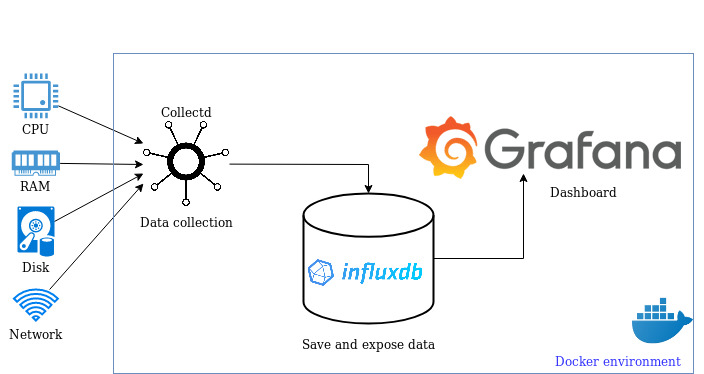

# (Grafana + InfluxDB + CollectD) / Docker



This repository shows how to use a docker to setup a local collectd, influxdb,
grafana stack.

You can use this repository to try collect system data, store it in influxdb
and create graph chart in Grafana.

Thanks to [Han Xiao](https://github.com/justlaputa/collectd-influxdb-grafana-docker) for
initial work.

# Installation

* Clone this repository and run:

```
$ docker-compose up -d --build
```

* Then you can open <http://localhost:3000>  grafana web page (login with admin/admin)


# On a swarm cluster

- Setup Swarm Cluster

```bash

export MONITORING_MASTER_IP=XXX.XXX.XXX.XXX


# if you're on the master node, you can just use the following command
export MONITORING_MASTER_IP=$(ip route get 8.8.8.8 | awk '{print $NF; exit}')

docker stack rm cluster-monitor
docker stack deploy --compose-file docker-compose.yml cluster-monitor
```
